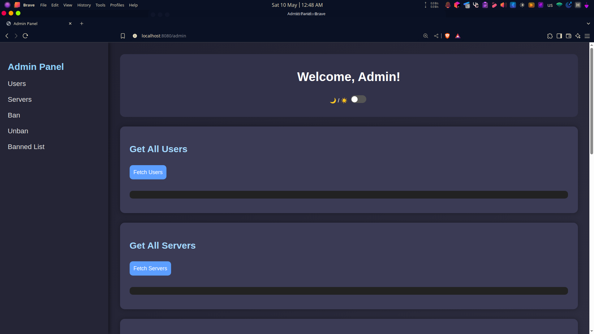
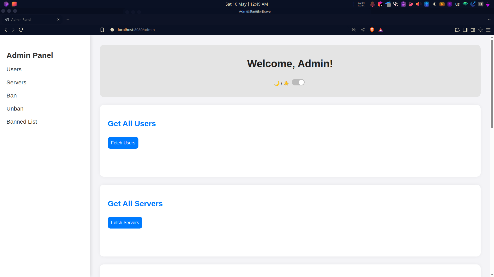
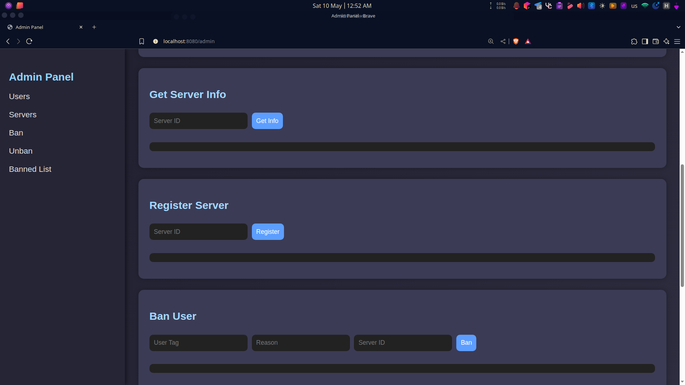
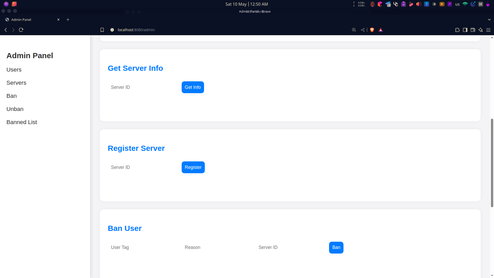
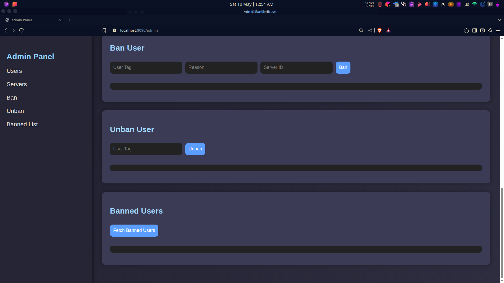
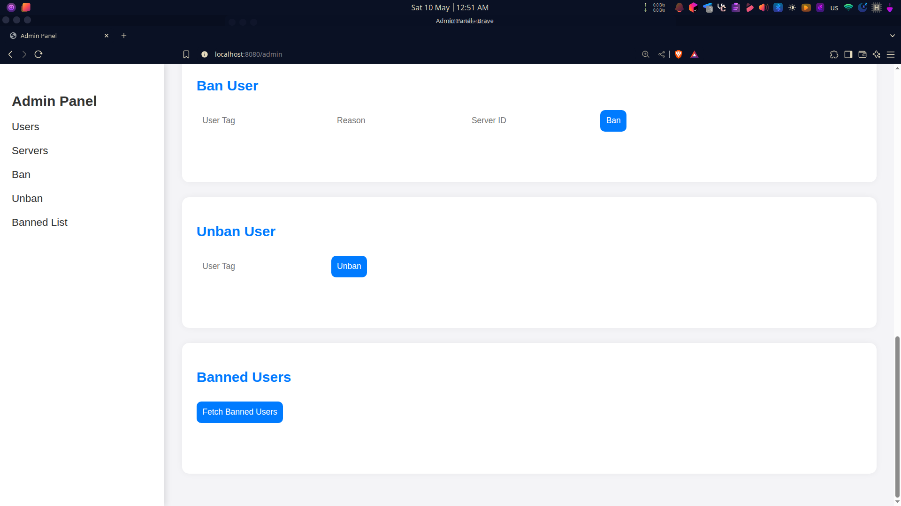

# Sprida
## Discord Bot with Spring Boot and JDA

Sprida is a powerful and extendable Discord bot built using [Spring Boot](https://spring.io/projects/spring-boot) and [JDA](https://github.com/DV8FromTheWorld/JDA). It uses PostgreSQL for persistent storage and Lombok to minimize boilerplate code.

---

## 🚀 Features

- ✅ Custom commands for engaging with users
- 🗄️ PostgreSQL database integration
- 🧰 Lombok to reduce repetitive code
- 🛠️ Admin panel (coming soon!) for bot configuration

---

## ⚙️ Setup

### Prerequisites

- Java 11 or newer
- [PostgreSQL](https://www.postgresql.org/)
- [Gradle](https://gradle.org/)
- Discord bot token

---

### 🔧 Installation

1. **Clone the repository:**

   ```bash
   git clone https://github.com/range79/sprida.git
   cd sprida


2. **Configure `application.yml`:**

   Create and update `src/main/resources/application.yml`:

   ```yaml
   spring:
     datasource:
       url: jdbc:postgresql://localhost:5432/dbname_in_compose_yaml
       username: your_username
       password: your_password

   discord:
     bot:
       server_id: your_server_id
       token: your_discord_bot_token
       log:
         channel_id: your_log_channel_id
       allow-connect-other-servers: true

   app:
    version: "${version}"
    admin-name: #admin name
    admin-pass: # admin password
    mod-name: # moderator name
    mod-pass: # moderator password
   ```

3. **(Optional) Use Docker Compose for PostgreSQL:**

   Create a `compose.yaml` file in the root directory:

   ```yaml
   version: '3.9'

   services:
     db:
       image: postgres
       restart: always
       shm_size: 128mb
       environment:
         POSTGRES_USERNAME: your_username
         POSTGRES_PASSWORD: your_password
         POSTGRES_DB: dbname_in_compose_yaml
       ports:
         - "5432:5432"
   ```

4. **Build the project:**

   ```bash
   ./gradlew build
   ```

5. **Run the bot:**

   ```bash
   ./gradlew bootRun
   ```

6. 🎉 Your bot will start and connect to Discord!

---

## 🖥️ Admin Panel (Preview)

| Dark Mode                        | Light Mode                        |
| -------------------------------- | --------------------------------- |
|   |   |
|  |  |
|  |  |

---

## 📄 License

This project is licensed under the [MIT License](https://opensource.org/licenses/MIT).

---

## 📌 [Changelog](CHANGELOG.md)

For latest updates and changes, check out the [CHANGELOG.md](CHANGELOG.md).

